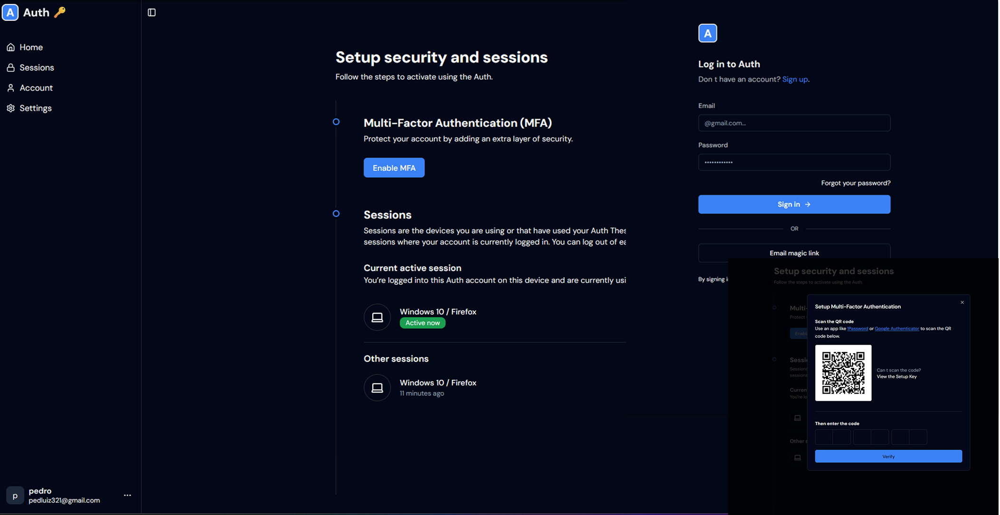

# Auth

Auth is a fullstack JavaScript application focused on Multi-Factor Authentication (MFA). The goal of this project is to implement and test MFA concepts using an Express.js backend and a Next.js frontend.

## Technologies Used

- **Backend**: Express.js, Speakeasy, QRCode, Resend
- **Database**: MongoDB
- **Frontend**: Next.js

## Features

- Multi-Factor Authentication (MFA) with Speakeasy and QRCode
- Password recovery via email
- Login via Magic Link
- Session management

## How to Run the Project

### 1. Clone the Repository

```sh
 git clone https://github.com/pedro5g/auth
 cd auth
```

### 2. Set Up Environment Variables

Create a `.env` file in frontend and backend root and fill it with the necessary variables.

### 3. Run the Cloning Script

Register and execute the `clone.sh` script:

```sh
 chmod +x clone.sh
 ./clone.sh
```

### 4. Run the Development Script

Register and execute the `dev.sh` script:

```sh
 chmod +x dev.sh
 ./dev.sh
```

## Presentation

- 
